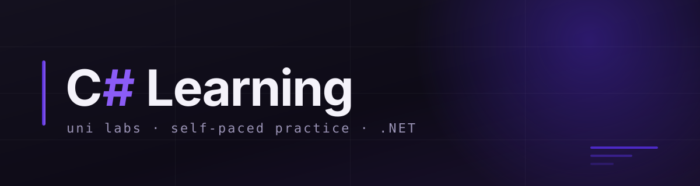

<div align="center">




</div>

---

# csharp-learning — the code I write while learning C#

Two axes, deliberately different. `uni/` runs chronologically — the order is set by the
lecturer, not by me. `learning/` runs thematically, at my own pace. Merging them into a
single numbering would mean bending my own pace to somebody else's timetable, so they sit
apart and never overlap.

---

## 🎓 Labs

| № | Topic | What it practises |
|---|---|---|
| 01 | Linear algorithms, branching | if/else, switch expression, parsing input |

---

## 🗂 Structure

```
csharp-learning/
├── assets/              — repository banner
├── uni/
│   └── labs/
│       └── lab01/       — one lab = one folder
│           └── task01/  — one task = one folder
└── learning/
    ├── 01-basics/       — types, expressions, control flow
    ├── 02-oop/          — classes, interfaces, inheritance
    └── 03-collections/  — List, Dictionary, LINQ
```

Folder numbering in `learning/` is two digits with a hyphen, so that sorting by name matches
the order I work through them and doesn't break at the tenth topic.

---

## 🛠 Stack

| | |
|---|---|
| Runtime | .NET 10.0 |
| IDE | JetBrains Rider |
| OS | macOS |
